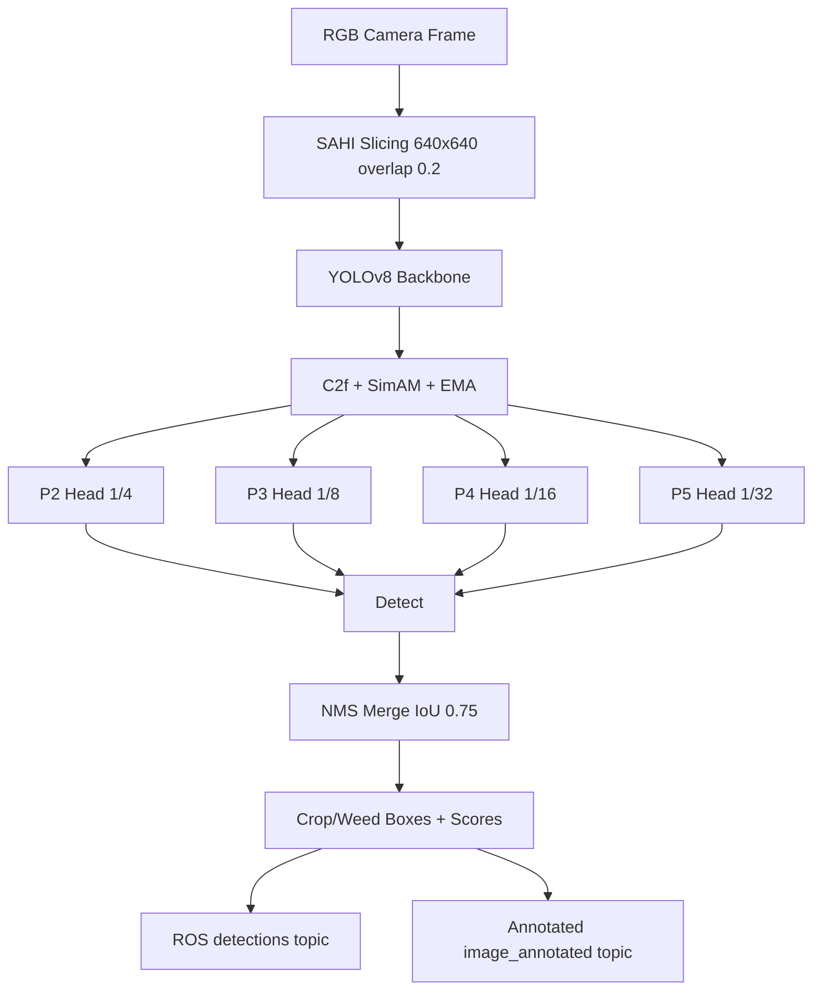

# Agribot v1.1 - Precision Agriculture Detection (YOLOv8 + SAHI)

Production-ready crop/weed detection stack for field robotics with:
- Unified multi-source data ingestion (`Kaggle + local`) and class normalization
- YOLOv8 P2-P5 four-head detector (`P2` for tiny seedlings/weeds)
- SimAM + EMA-enhanced `C2f` blocks
- Custom IoU regression options (`InnerMPDIoU` / `PIoU` hooks)
- SAHI sliced inference (`640x640`, overlap `0.2`, NMS IoU `0.75`)
- ROS2 lifecycle perception node with annotated stream publishing

## Validation Summary

| Metric | Value |
|---|---:|
| Precision | 0.5220 |
| Recall | 0.3669 |
| mAP@0.5 | 0.4360 |
| mAP@0.5:0.95 | 0.3540 |
| Parameters | 3,182,904 |
| Preprocess Latency (ms/img) | 3.07 |
| Inference Latency (ms/img) | 215.56 |
| Postprocess Latency (ms/img) | 3.12 |

Source: [`results/metrics_summary.json`](results/metrics_summary.json)

## Plots

### Normalized Confusion Matrix (Plasma)


### F1-Confidence Curve (Shaded AUC)


### Bootstrapped mAP@0.5 Stability (n=1000)


## Architecture (P2-P5 + Attention + SAHI)



## Repository Layout

- `tools/pc_training/precision_agri_pipeline/` - end-to-end training/eval/inference pipeline
- `src/agribot_perception/agribot_perception/perception_node.py` - ROS2 lifecycle SAHI+YOLO node
- `src/agribot_perception/agribot_perception/sahi_runtime.py` - runtime SAHI wrapper + OpenCV overlays
- `results/` - publication assets and metrics snapshots

## Installation

```bash
pip install ultralytics sahi numpy scikit-learn matplotlib seaborn opencv-python
```

For ROS2 packages, install workspace dependencies and rebuild:

```bash
colcon build --symlink-install
source install/setup.bash
```

## Data Ingestion (Unified YOLO Dataset)

```bash
python -m tools.pc_training.precision_agri_pipeline.run_pipeline \
  --skip-train --skip-sahi --skip-eval \
  --local-dataset-roots cropweed_dataset cropweed_yolo_dataset \
  --allow-partial-downloads --online-sample-ratio 0.25 --online-max-samples 300
```

## Training (CPU-safe profile example)

```bash
python -m tools.pc_training.precision_agri_pipeline.run_pipeline \
  --skip-ingest --skip-sahi --skip-eval \
  --data datasets/unified_rice_weed_yolo/data.yaml \
  --device cpu --epochs 50 --imgsz 512 --batch 1 --workers 0 --cpu-safe
```

## One-Command Inference (SAHI)

```bash
python -m tools.pc_training.precision_agri_pipeline.sahi_inference \
  --model C:/Users/FRIDAY/runs/detect/runs/precision_agri/yolov8_p2_simam_ema-4/weights/best.pt \
  --data D:/agribot/datasets/unified_rice_weed_yolo/data.yaml \
  --split test
```

## ROS2 Launch (Live Camera -> SAHI -> Annotated Stream)

```bash
ros2 launch agribot_bringup perception.launch.py \
  model_path:=C:/Users/FRIDAY/runs/detect/runs/precision_agri/yolov8_p2_simam_ema-4/weights/best.pt \
  conf_threshold:=0.25
```

Published topics:
- `/detections` (`agribot_msgs/DetectionArray`)
- `/image_annotated` (`sensor_msgs/Image`)

Class colors:
- `crop`: vivid green
- `weed`: hot pink

## References

1. Yang, L., Zhang, R.-Y., Li, L., Xie, X. **SimAM: A Simple, Parameter-Free Attention Module for Convolutional Neural Networks.** ICML 2021. https://proceedings.mlr.press/v139/yang21o.html
2. Ouyang, D., et al. **Efficient Multi-Scale Attention Module with Cross-Spatial Learning.** ICASSP 2023 / arXiv:2305.13563. https://arxiv.org/abs/2305.13563
3. Ma, S., Xu, Y. **MPDIoU: A Loss for Efficient and Accurate Bounding Box Regression.** arXiv:2307.07662. https://arxiv.org/abs/2307.07662
4. Chen, Z., et al. **PIoU Loss: Towards Accurate Oriented Object Detection in Complex Environments.** ECCV 2020. https://doi.org/10.1007/978-3-030-58558-7_12
5. Akyon, F. C., Altinuc, S. O., Temizel, A. **Slicing Aided Hyper Inference and Fine-tuning for Small Object Detection.** arXiv:2202.06934. https://arxiv.org/abs/2202.06934
6. Rice Weed Dataset (Kaggle). https://www.kaggle.com/datasets/ac1903/rice-weed-dataset
7. Rice Leaf Disease Image (Kaggle). https://www.kaggle.com/datasets/nirmalsankalana/rice-leaf-disease-image
8. Weed Detection (Kaggle). https://www.kaggle.com/datasets/jaidalmotra/weed-detection
