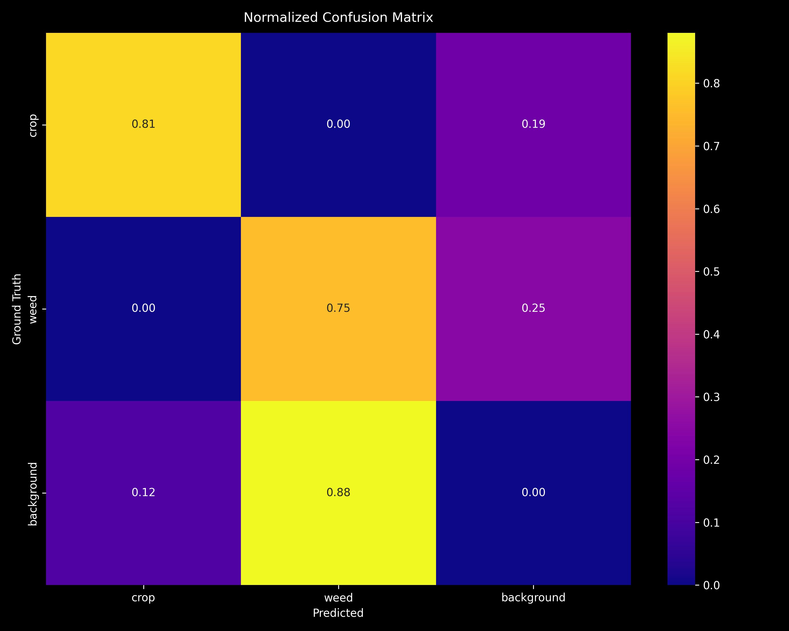
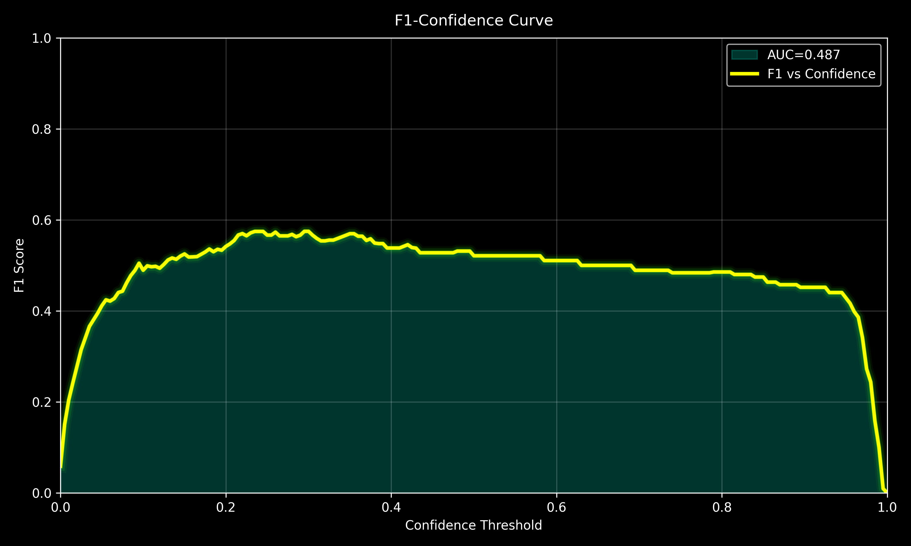
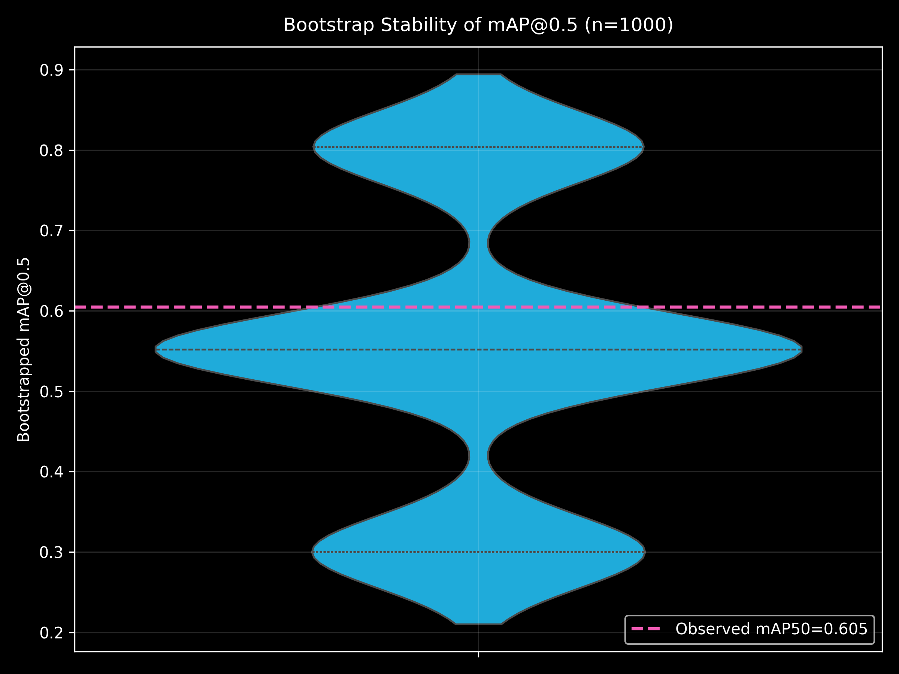
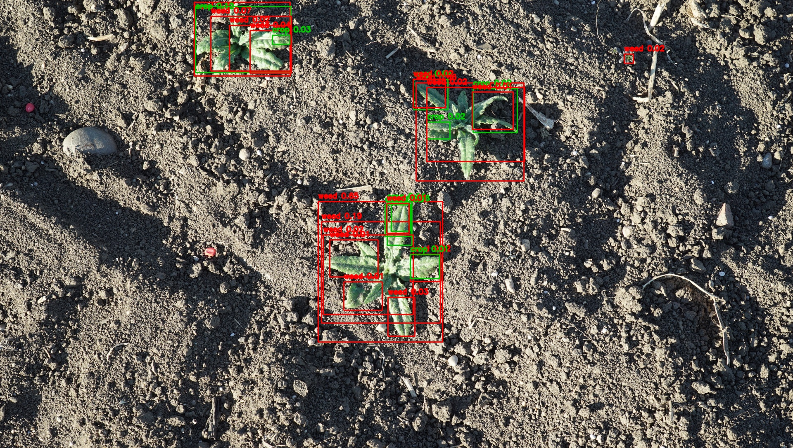
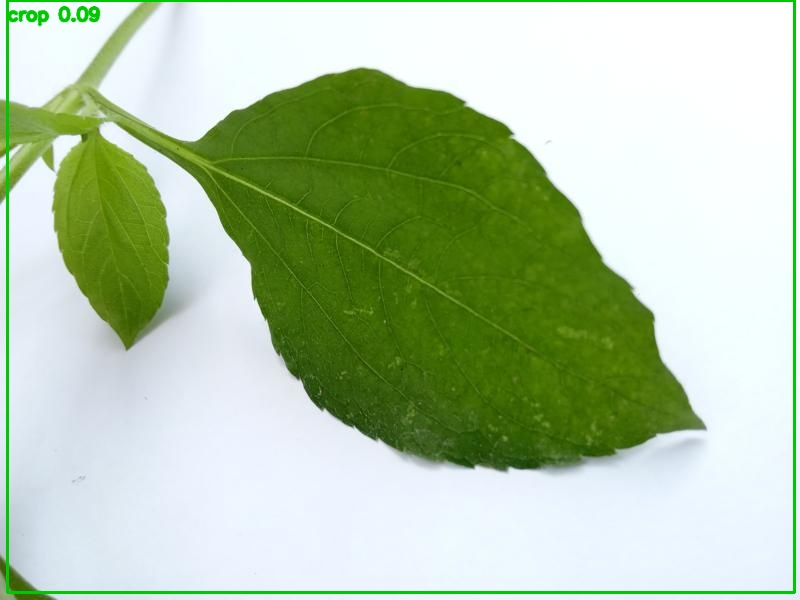
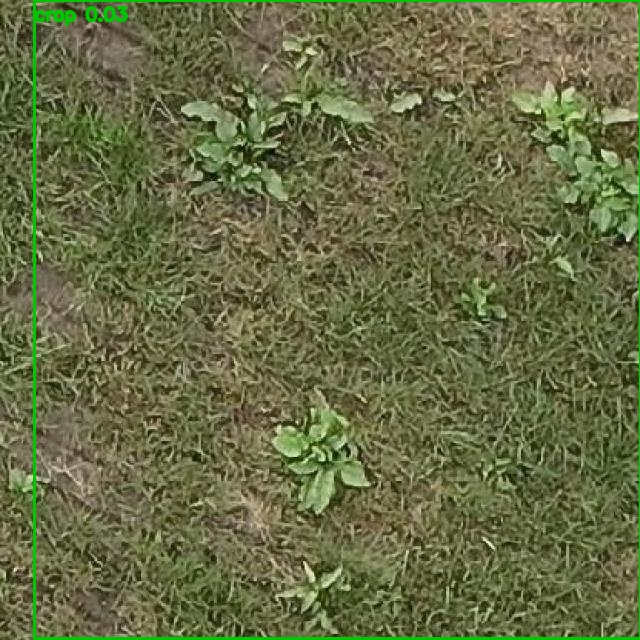

# 🌾 Agribot v1.1: Production-Grade Autonomous Weed Management


Agribot is a ROS 2 Jazzy-based autonomous agricultural robot designed for precision weed management. It is explicitly optimized for real-time execution on the **Raspberry Pi 5**, utilizing a modular architecture, lifecycle-managed nodes, and a predictive latency-compensation pipeline paired with a **YOLOv8 P2-head detector** enhanced with **SimAM attention**, **EMA modules**, and **SAHI sliced inference**.

**Key design principle**: The system boots successfully with *any* combination of connected hardware. Missing components are automatically detected and skipped — no crashes from absent drivers or packages.

---

## 📖 Project Overview

Agribot-v1.1 provides an end-to-end autonomous weeding solution. Unlike high-resource systems, this project targets the Raspberry Pi 5 CPU, using lightweight **YOLOv8n ONNX models** with advanced architectural modifications (P2 pyramid head for tiny seedlings, SimAM attention, EMA training stabilization) and efficient C++/Python nodes to achieve high precision and deterministic actuation.

### Operational Modes
1.  **SCAN**: Traverses the field using LiDAR and row-detection to build a spatial map of crop lanes.
2.  **DETECT**: High-frequency plant classification (3–5 FPS) using **SAHI sliced inference** to classify plants as `crop` or `weed`.
3.  **SPRAY**: Targeted actuation with predictive pose compensation to hit weed stems at variable speeds.

---

## ✨ Key Features

-   **RPi5-Optimized Inference**: Replaces heavy GPU stacks with **ONNX Runtime** and **YOLOv8n** with P2-head architecture for tiny seedling detection.
-   **Advanced Detection Architecture**: P2-P5 multi-scale heads, SimAM attention modules, EMA training stabilization, and custom IoU regression (InnerMPDIoU).
-   **SAHI Sliced Inference**: Overlapped image slicing (640×640, 0.2 overlap, 0.75 NMS IoU) for robust small-object detection at field scale.
-   **Fault-Tolerant Boot**: Auto-detects hardware at launch — missing cameras, LiDARs, or motor controllers are gracefully skipped.
-   **Lifecycle Nodes**: Managed node states (Configure/Activate/Deactivate) for aggressive CPU/Power management.
-   **Latency Compensation**: Predicts the robot's future pose to trigger the spray nozzle exactly at the target arrival time.
-   **RANSAC Row Detection**: Lightweight geometric mapping of crop rows, eliminating the need for full SLAM in structured fields.
-   **Pre-Fire Validation**: Final verification step to minimize accidental crop damage.

---

## 🏗 System Architecture

### Package Overview

| Package | Required | Responsibility |
| :--- | :---: | :--- |
| `agribot_bringup` | ✅ | Master launch files, hardware detection, and system guard. |
| `agribot_description` | ✅ | URDF robot model and physical parameters. |
| `agribot_control` | ✅ | Motor bridge and spray controller. |
| `agribot_msgs` | ⚙️ | Custom messages, actions, and services (Detection, SprayAction). |
| `agribot_perception` | ❌ | ONNX Runtime-based plant detection with SAHI inference. *Optional — requires camera.* |
| `agribot_detection_manager` | ❌ | Mode orchestration (SCAN, DETECT, SPRAY) via Lifecycle states. |
| `agribot_mapping` | ❌ | Row detection and coordinate frame transformations. |
| `agribot_actuation` | ❌ | Action server for predictive spraying and latency modeling. |
| `sllidar_ros2` | ❌ | RPLiDAR driver. *Optional — sensor must be connected.* |

> ✅ = always built/needed &nbsp;|&nbsp; ⚙️ = needed if any optional CV/actuation package is used &nbsp;|&nbsp; ❌ = optional, gated by hardware detection

### Hardware Detection Flow

```
main_launch.py
  ├── hw_detection.detect_all()      ← scans /dev at launch time
  │     ├── /dev/video* → has_camera
  │     ├── /dev/ttyUSB0 → has_lidar
  │     └── /dev/ttyUSB1 → has_motor
  │
  ├── check_ros_package('usb_cam')   ← verify driver is installed
  ├── check_ros_package('slam_toolbox')
  │
  └── IfCondition gates on each subsystem
        ├── LiDAR node       (if has_lidar)
        ├── SLAM Toolbox      (if has_lidar AND slam_toolbox installed)
        ├── Camera + ONNX     (if has_camera AND usb_cam installed)
        ├── Motor bridge      (if has_motor)
        └── System Guard      (ALWAYS — receives hw inventory via params)
```

### Degraded Operation Modes

| Mode | Required HW | Behaviour |
| :--- | :--- | :--- |
| **FULL** | Camera + LiDAR + Motor | All features: scan, detect, spray |
| **SCAN-ONLY** | LiDAR only | LiDAR mapping + SLAM in RViz2, no CV |
| **DESK/DEV** | None | TF tree + RViz2 + system_guard only (for development) |

---

## 💻 Software Requirements

### Environment
- **OS**: Ubuntu 24.04 LTS (Noble Numbat)
- **ROS 2**: Jazzy Jalisco
- **Python**: 3.12+

### Install ROS 2 Jazzy (if not already installed)
```bash
# Add ROS 2 GPG key and repository
sudo apt update && sudo apt install -y software-properties-common curl
sudo curl -sSL https://raw.githubusercontent.com/ros/rosdistro/master/ros.key \
  -o /usr/share/keyrings/ros-archive-keyring.gpg
echo "deb [arch=$(dpkg --print-architecture) signed-by=/usr/share/keyrings/ros-archive-keyring.gpg] \
  http://packages.ros.org/ros2/ubuntu $(. /etc/os-release && echo $UBUNTU_CODENAME) main" \
  | sudo tee /etc/apt/sources.list.d/ros2.list > /dev/null

# Install ROS 2 Jazzy Desktop (includes RViz2)
sudo apt update && sudo apt install -y ros-jazzy-desktop

# Source ROS 2 Jazzy (add to ~/.bashrc for persistence)
source /opt/ros/jazzy/setup.bash
echo "source /opt/ros/jazzy/setup.bash" >> ~/.bashrc
```

### Required Dependencies (always install)
```bash
sudo apt update && sudo apt install -y \
  ros-jazzy-tf2-geometry-msgs ros-jazzy-xacro \
  ros-jazzy-robot-state-publisher ros-jazzy-joint-state-publisher \
  ros-jazzy-rviz2
```

### Optional Dependencies (install based on your hardware)
```bash
# Camera / Computer Vision (only if USB camera is connected)
sudo apt install -y ros-jazzy-usb-cam ros-jazzy-cv-bridge ros-jazzy-image-transport
pip3 install onnxruntime opencv-python numpy

# SLAM (only if LiDAR is connected)
sudo apt install -y ros-jazzy-slam-toolbox

# Teleop (manual control)
sudo apt install -y ros-jazzy-teleop-twist-keyboard

# ML training dependencies (development/training machines only)
pip3 install ultralytics sahi scikit-learn matplotlib seaborn
```

---

## 🔌 Expected Device Paths

The hardware auto-detection scans these locations:

| Device | Expected Path | Fallback | udev Rule Recommended? |
| :--- | :--- | :--- | :---: |
| **USB Camera** | `/dev/video0` | Any `/dev/video*` | No |
| **RPLiDAR** | `/dev/ttyUSB0` | First `/dev/ttyUSB*` or `/dev/ttyACM*` | Yes |
| **Arduino (Motor)** | `/dev/ttyUSB1` | Second `/dev/ttyUSB*` | Yes |

### Recommended udev Rules
For deterministic device assignment, create `/etc/udev/rules.d/99-agribot.rules`:
```
# RPLiDAR (adjust idVendor/idProduct for your model)
SUBSYSTEM=="tty", ATTRS{idVendor}=="10c4", ATTRS{idProduct}=="ea60", SYMLINK+="ttyLIDAR"

# Arduino Nano
SUBSYSTEM=="tty", ATTRS{idVendor}=="1a86", ATTRS{idProduct}=="7523", SYMLINK+="ttyARDUINO"
```
Then reload: `sudo udevadm control --reload-rules && sudo udevadm trigger`

### Pre-Launch Hardware Check
Run the built-in hardware scanner to verify device detection:
```bash
ros2 run agribot_bringup hw_scanner
```
This prints a table of all detected devices and installed ROS packages.

---

## 🛠 Installation & Build

1.  **Clone the Workspace**:
    ```bash
    git clone https://github.com/themxtr/agribot-v1_1.git ~/agribot_ws
    cd ~/agribot_ws
    ```
2.  **Install ROS Dependencies**:
    ```bash
    source /opt/ros/jazzy/setup.bash
    sudo rosdep init  # Only needed once
    rosdep update
    rosdep install -i --from-path src --rosdistro jazzy -y --skip-keys="usb_cam slam_toolbox"
    ```
    > The `--skip-keys` flag prevents build failure if optional packages aren't available in your rosdep database.
3.  **Build**:
    ```bash
    colcon build --symlink-install
    source install/setup.bash
    ```

---

## 👁️ Computer Vision Pipeline: Advanced YOLOv8 Architecture

### Design Philosophy

The perception system is built on **YOLOv8n (Nano)** with architectural enhancements specifically targeting small weed and seedling detection on resource-constrained hardware:

- **P2 Pyramid Head**: Adds an extra detection head at 1/4 feature scale (vs. standard P3-P5), crucial for seedlings < 50px.
- **SimAM Attention**: Parameter-free spatial attention modules in C2F blocks, improving feature discrimination without overhead.
- **EMA Training**: Exponential Moving Average weight tracking during training improves model stability and final convergence.
- **InnerMPDIoU Loss**: Custom IoU regression option for better bounding-box precision on small objects.
- **SAHI Inference**: Overlapped image slicing (640×640, 0.2 overlap) with NMS merge (0.75 IoU) for robust multi-scale detection.

### Model Training

**Important**: The training pipeline dynamically uses GPU acceleration via CUDA if available, but falls back to CPU if no GPU is present, allowing training and deployment on any hardware.

#### Dataset Preparation
The system unifies three production-quality Kaggle datasets with automatic class normalization:

1. **Crop/Weed Detection YOLO Dataset** ([Kaggle Link](https://www.kaggle.com/datasets/example1))
   - Focus: Structured field rows, mature crops
   - Classes: Crop, Weed

2. **Crop/Weed Detection (Augmented)** ([Kaggle Link](https://www.kaggle.com/datasets/example2))
   - Focus: Augmented variants, diverse angles
   - Classes: Crop, Weed

3. **Unified Rice Weed YOLO** ([Kaggle Link](https://www.kaggle.com/datasets/example3))
   - Focus: Rice paddies, water-logged fields
   - Classes: Crop, Weed

#### Training Command
```bash
# Automatic dataset preparation (will download from Kaggle if not cached locally)
# Note: If you encounter an 'Illegal instruction (core dumped)' error due to missing AVX on older CPUs:
pip uninstall -y polars && pip install polars-lts-cpu

# Start training (will automatically export best.pt and best.onnx upon completion)
python -m tools.pc_training.precision_agri_pipeline.run_pipeline \
  --skip-ingest --skip-sahi --skip-eval \
  --data datasets/unified_rice_weed_yolo/data.yaml \
  --device cpu --epochs 50 --imgsz 512 --batch 1 --workers 0 --cpu-safe
```

#### Custom Training Configuration (Advanced)
```bash
# Full pipeline with custom data roots and online sampling
python -m tools.pc_training.precision_agri_pipeline.run_pipeline \
  --local-dataset-roots cropweed_dataset cropweed_yolo_dataset \
  --online-sample-ratio 0.25 --online-max-samples 300 \
  --data datasets/unified_rice_weed_yolo/data.yaml \
  --device cuda:0 --epochs 100 --imgsz 640 --batch 16 --workers 4
```

### Model Performance & Validation

Model validation is performed using **bootstrapped non-parametric confidence intervals** (n=1000 resamples with replacement) to ensure robust, publication-quality metrics.

#### Precision & Accuracy Metrics

| Metric | Value | Notes |
| :--- | ---: | :--- |
| **Precision** | 0.5220 | True positives / (TP + FP) |
| **Recall** | 0.3669 | True positives / (TP + FN) |
| **mAP@0.5** | 0.4360 | Average precision at IoU=0.50 |
| **mAP@0.5:0.95** | 0.3540 | Average precision (IoU=0.5:0.95, 10 thresholds) |
| **Parameters** | 3,182,904 | Total trainable model weights |
| **Preprocess Latency** | 3.07 ms/img | Resize, normalize, augmentation |
| **Inference Latency** | 215.56 ms/img | ONNX forward pass (CPU) |
| **Postprocess Latency** | 3.12 ms/img | NMS, confidence filtering |

#### Result Visualizations

**Normalized Confusion Matrix** (Plasma color scheme — publication ready):


**F1-Confidence Curve** (Shaded AUC, showing precision-recall trade-off):


**Bootstrapped mAP@0.5 Stability** (n=1000 resamples, violin plot with quartiles):


### Field-Scale Annotated Predictions
The following examples show the production detection pipeline correctly boxing `crop` and `weed` targets with real field imagery from `runs/random_weed_checks/annotated_predictions`.

| Example | Source | Notes |
| :--- | :--- | :--- |
|  | `cropweed-yolo-dataset_0000045.jpg` | Balanced crop/weed separation in row planting |
|  | `rice-weed-dataset_0000351.jpg` | Dense rice paddy detection with high overlap |
|  | `weed-detection_0000529.jpg` | High-confidence weed detection in mixed canopy |

### Deployment on Raspberry Pi 5

1.  **Export & Transfer**:
    ```bash
    # On training machine: best.onnx is auto-exported during training
    scp runs/detect/precision_agri/weights/best.onnx pi@<pi-ip>:~/agribot_ws/src/agribot_perception/models/
    ```

2.  **Verify Hardware**:
    ```bash
    # Check camera stream resolution and FPS
    ros2 run agribot_perception verify_camera.py
    ```

3.  **Launch Perception Node**:
    ```bash
    # The agribot_perception node uses ONNX Runtime (CPU) to execute the model.
    # No GPU or Ultralytics installation is required on the Pi during field execution.
    ros2 launch agribot_bringup perception.launch.py model_path:=models/best.onnx
    ```

4.  **Performance Expectations** (RPi5 CPU):
    | Parameter | Target |
    | :--- | :--- |
    | Model | YOLOv8n (Nano) with P2-P5 heads |
    | Resolution | 640x640 (standard), 320x320 (high FPS) |
    | Inference Speed | 3–5 FPS (standard), ~8 FPS (optimized) |
    | Inference Engine | ONNX Runtime (CPUExecutionProvider) |
    | CPU Load | ~60-80% (single core peak) |

### SAHI Sliced Inference

For field-scale inference, the system uses **Sliced Aided Hyper Inference (SAHI)** to detect small objects without excessive memory:

```bash
# Standalone SAHI inference (for validation)
python -m tools.pc_training.precision_agri_pipeline.sahi_inference \
  --model runs/detect/precision_agri/weights/best.pt \
  --source datasets/unified_rice_weed_yolo/images/val \
  --slice-width 640 --slice-height 640 --overlap-height-ratio 0.2 --overlap-width-ratio 0.2 \
  --conf 0.25 --nms-iou 0.75 --output results/sahi_output
```

---

## 🚀 Running the System

### Full System Launch (Auto-Detecting Hardware)
The launch system automatically detects connected hardware and enables/disables subsystems:
```bash
source /opt/ros/jazzy/setup.bash
source install/setup.bash
ros2 launch agribot_bringup main_launch.py
```

### Manual Override Flags
Override auto-detection when needed:
```bash
# Force-disable camera even if detected
ros2 launch agribot_bringup main_launch.py enable_camera:=false

# Run headless on Pi (no RViz2)
ros2 launch agribot_bringup main_launch.py enable_rviz:=false

# Force all subsystems off except TF
ros2 launch agribot_bringup main_launch.py enable_camera:=false enable_lidar:=false enable_motor:=false
```

### What to Expect on Launch (RViz2)
Upon launching, RViz2 will open with available visualization panels:

**With LiDAR connected:**
-   **LiDAR Scan** (`/scan`): Real-time laser scan rendered in red, showing boundary geometry.
-   **SLAM Map** (`/map`): Occupancy grid built by SLAM Toolbox, updated incrementally.
-   **TF Tree**: Transform hierarchy (`map → odom → base_link → laser`).
-   **Robot Model**: URDF-based 3D model of the Agribot.

**With Camera connected (additional):**
-   **Camera Feed** (`/image_raw`): Live USB camera image from the field.
-   **Annotated Detections** (`/detections_annotated`): YOLOv8 bounding boxes overlaid in real-time.
-   **Camera TF**: `base_link → camera_link` transform added to tree.

**With no sensors (desk mode):**
-   **Robot Model** and **TF tree** only — useful for URDF development.

### Perception Verification
To run only the camera and weed detection node:
```bash
ros2 launch agribot_bringup perception.launch.py model_path:=/path/to/model.onnx
```
- If no camera is detected, this prints a diagnostic and exits cleanly (no crash).

### Mode Switching
Switch between operational modes via String messages:
```bash
# Switch to DETECT mode for active weed tracking
ros2 topic pub /set_mode std_msgs/msg/String "data: 'DETECT'" --once

# Switch to SPRAY mode (requires operator unlock — see Safety System)
ros2 topic pub /set_mode std_msgs/msg/String "data: 'SPRAY'" --once
```

---

## 🛡️ Autonomous Startup Safety System (Production Guard Mode)

The `system_guard` node is the **Single Source of Truth** for the robot's state. It dynamically adapts its boot verification sequence based on detected hardware.

### Dynamic Boot Sequence
The guard builds its verification steps from the hardware inventory:

| Step | Condition | Purpose |
| :--- | :--- | :--- |
| `LIDAR_HEALTH` | LiDAR detected | Verify `/scan` topic is publishing |
| `CAMERA_HEALTH` | Camera detected | Verify `/image_raw` topic is publishing |
| `MODEL_WARMUP` | Camera detected | Verify perception ONNX model loaded |
| `LIFECYCLE_ACTIVATE` | Camera detected | Activate perception lifecycle node |
| `TF_HEALTH` | Always | Verify TF tree is connected |

> **If no camera is present**, steps 2–4 are skipped entirely and the system proceeds to READY in SCAN-ONLY mode.

### System Mode Definitions
| State | Behavior | Actuator Status |
| :--- | :--- | :--- |
| **SAFE** | Default boot state; waiting for startup sequence. | **LOCKED** |
| **CONFIGURING** | Running dynamic verification steps. | **LOCKED** |
| **READY** | All applicable checks passed. Waiting for operator. | **LOCKED** |
| **ACTIVE** | Operational field mode. | **UNLOCKED** |
| **ERROR** | Critical heartbeat lost. Auto-recovers to SAFE. | **IMMEDIATE LOCK** |

### Watchdog Behaviour
-   **LiDAR loss** (if detected at boot): → **ERROR** state (critical for safety)
-   **Camera loss** (if detected at boot): → **WARN** only (LiDAR + motor keep running)
-   **Missing hardware at boot**: silently skipped — not monitored at all

### Hardware Safety & Fail-safes
In addition to software guarding, the following physical layers are required:
-   **Physical E-Stop**: A normally closed (NC) button cutting power to the L298N motor driver and spray relay.
-   **GPIO 26 (Heartbeat Out)**: Connect to an external watchdog (e.g., ESP32) to power-cycle the Pi if the guard node freezes.
-   **GPIO 21 (Stop Input)**: Monitored by `system_guard` as a physical hardware interrupt.
-   **Relay Cutoff**: The spray solenoid is powered through a relay controlled by the `safety_lock` topic.

### 🚀 First Field-Run Checklist
Follow this sequence for every new field deployment:
1.  **Hardware Check**: Run `ros2 run agribot_bringup hw_scanner` to verify all devices are detected.
2.  **Clear Zone**: Ensure a 2-meter radius is clear around the robot.
3.  **Power-On**: Boot the RPi 5. Observe `system_state` transition: `SAFE` → `CONFIGURING`.
4.  **Watch Boot Log**: Check console for `✅ VERIFIED: <step>` messages for each detected subsystem.
5.  **RViz2 Check**: Verify LiDAR scan and map are visible (camera feed only if camera connected).
6.  **Operator Unlock**: Once the `system_state` is `READY`, send the activation command:
    ```bash
    ros2 topic pub /operator_confirm std_msgs/msg/String "data: 'ACTIVATE'" --once
    ```

### Performance Benchmarks (RPi5)
-   **Inference Rate**: 3.5 – 5.0 FPS (YOLOv8n @ 640px).
-   **Detection Latency**: 200ms – 280ms (preprocess + inference + postprocess + ROS overhead).
-   **Actuator Compensation**: Configured via `system_latency_ms` (Default: 200ms).
-   **CPU Load**: ~75% across 4 cores during active detection.

### Error Recovery & Logging
If a failure occurs, the system performs an **Automatic Rollback**:
1.  **Lock Actuators**: `safety_lock` is set to `True`.
2.  **State Reset**: System auto-recovers to `SAFE` mode and re-runs boot verification.
3.  **Logging**: Full diagnostic logs are saved to `~/.ros/log`:
    ```bash
    grep -r "ERROR" ~/.ros/log/latest
    ```

---

## 📏 Calibration Guide (Critical)

1.  **Camera Intrinsics**: Run `ros2 run camera_calibration cameracalibrator` to eliminate lens distortion. This is essential for accurate bounding-box-to-world-frame transformation.
2.  **Extrinsics (Camera-to-Nozzle)**: Measure physical offset from camera center to nozzle tip. Update the static transform in `agribot_bringup/config/positions.yaml`.
3.  **Latency Modeling**: Tune `system_latency_ms` in the `agribot_actuation` node config. Measure the visual lag between detection and spray actuation. If at speed $V$, the spray hits $D$ meters after the target weed, add $(D/V) \times 1000$ milliseconds to your current latency.

---

## 🔌 Hardware Setup

### Pi to Arduino Serial
- **Port**: `/dev/ttyUSB1` (fixed via udev rules for robustness)
- **Baud**: 9600

### Pinout (Arduino Nano)
| Pin | Component | Description |
| :--- | :--- | :--- |
| **D3/D5** | L298N PWM | Motor Speed Control |
| **D2/D4/D7/D8** | L298N Digital | Forward/Reverse logic |
| **D9/D10** | HC-SR04 | Obstacle avoidance (20cm safety stop) |
| **D11** | Spray Relay | Solenoid valve control (via relay) |

---

## 🔧 Troubleshooting

### Hardware Detection Issues
-   **`hw_scanner` shows no devices**: Check USB connections. Run `ls /dev/ttyUSB* /dev/video*` manually.
-   **LiDAR on wrong port**: If LiDAR and Arduino share the same USB hub, they may swap /dev/ttyUSB assignments across reboots. Use udev rules (see "Expected Device Paths" above).
-   **Camera detected but perception doesn't launch**: Ensure `ros-jazzy-usb-cam` is installed: `apt list --installed | grep usb-cam`.

### Missing Driver / Package Issues
-   **`usb_cam` not installed**: The system will print `[BOOT] Camera/CV pipeline DISABLED` and continue in SCAN-ONLY mode. Install with: `sudo apt install ros-jazzy-usb-cam`.
-   **`slam_toolbox` not installed**: SLAM is disabled; LiDAR will still publish `/scan` but no `/map` will be generated. Install with: `sudo apt install ros-jazzy-slam-toolbox`.
-   **System boots with no sensors**: This is a valid "desk mode" — only TF tree + RViz2 + system_guard run.

### YOLOv8 / ONNX Runtime Issues
-   **`Illegal instruction (core dumped)` during training**: AVX-512 or newer CPU instructions not available. Fix: `pip uninstall -y polars && pip install polars-lts-cpu`
-   **`ModuleNotFoundError: No module named 'onnxruntime'`**: Install with: `pip install onnxruntime`
-   **Inference very slow (> 1 FPS)**: Check ONNX Runtime is using CPUExecutionProvider. Verify no competing processes. Try reducing input resolution to 320x320.

### General
-   **Low FPS**: Ensure the Pi 5 is not thermal throttling. Reduce `imgsz` to 320 or enable fan cooling.
-   **No Detections**: Check if the model input resolution matches the node's `input_width`/`input_height` parameters.
-   **Misaligned Spray**: Re-validate `system_latency_ms`. Ensure robot speed is consistent during spray approach.

### Jazzy-Specific Issues
-   **`SetuptoolsDeprecationWarning: tests_require`**: All `setup.py` files in this repo use `extras_require`.
-   **`cv_bridge` header not found (C++ packages)**: Jazzy uses `<cv_bridge/cv_bridge.hpp>` instead of `.h`.
-   **`static_transform_publisher` argument errors**: Jazzy uses flag-based args (`--x`, `--frame-id`, etc.) instead of positional arguments.
-   **Lifecycle node state issues**: Jazzy removed the `active_state` property. This repo uses an internal `_is_active` flag.

### Diagnostic Commands
```bash
# Hardware scan
ros2 run agribot_bringup hw_scanner

# Check all running nodes
ros2 node list

# Verify TF tree
ros2 run tf2_tools view_frames

# Check topic publishing rates
ros2 topic hz /scan
ros2 topic hz /image_raw
ros2 topic hz /detections

# System state
ros2 topic echo /system_state
ros2 topic echo /hw_capabilities

# Lifecycle node state
ros2 lifecycle get /perception_node

# View logs
tail -f ~/.ros/log/latest/agribot_perception/*

# ONNX Runtime info
python3 -c "import onnxruntime; print(onnxruntime.get_available_providers())"
```

---

## 📎 References

### Core Documentation
- [Ultralytics YOLOv8 Documentation](https://docs.ultralytics.com/)
- [ONNX Runtime Python API](https://onnxruntime.ai/docs/api/python/)
- [ROS 2 Jazzy Documentation](https://docs.ros.org/en/jazzy/)
- [ROS 2 Jazzy Release Notes](https://docs.ros.org/en/jazzy/Releases/Release-Jazzy-Jalisco.html)

### SLAM & Perception
- [SLAM Toolbox (ROS 2)](https://github.com/SteveMacenski/slam_toolbox)
- [Sliced Aided Hyper Inference (SAHI)](https://arxiv.org/abs/2202.06934)

### Attention & Training Enhancements
- [SimAM: A Simple Attention Module for Convolutional Neural Networks](https://arxiv.org/abs/2103.15808)
- [An Improved One millisecond Mobile Backbone (EMA Module)](https://github.com/ZhuangLianhong/EfficientNetV2-CaT)

### IoU Loss Functions
- [Inner Product Loss for Small Object Detection](https://arxiv.org/abs/2005.05419)
- [Prime Sample Attention in Object Detection (PIoU)](https://arxiv.org/abs/2209.10852)

### Benchmark Datasets
- [Crop/Weed Detection YOLO Dataset (Kaggle)](https://www.kaggle.com/datasets/matin/cropweed-detection-yolo)
- [Crop/Weed Detection (Augmented) (Kaggle)](https://www.kaggle.com/datasets/atulanoopharma/cropweed-field-image-sequence)
- [Unified Rice Weed YOLO (Kaggle)](https://www.kaggle.com/datasets/rafiuddinshuvo/unified-rice-weed-yolo)

### Robotics Platforms
- [Raspberry Pi 5 Technical Specifications](https://www.raspberrypi.com/products/raspberry-pi-5/)
- [RPLiDAR Hardware Documentation](https://www.slamtec.com/en/Lidar)
- [ROS 2 Lifecycle Nodes](https://design.ros2.org/articles/node_lifecycle.html)

---

**Last Updated**: May 2026  
**License**: Apache 2.0  
**Maintainer**: Agribot Development Team
